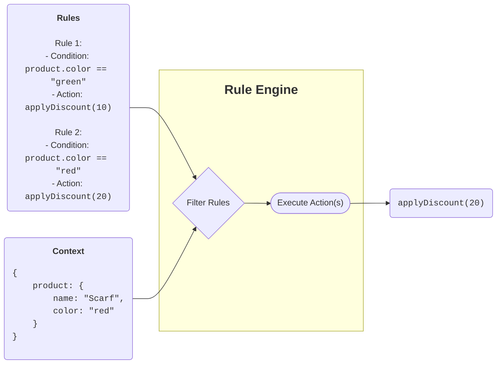

# ᚱᚢᚾᛖ

[](https://github.com/uuf6429/rune/actions)
[](https://packagist.org/packages/uuf6429/rune)
[](https://packagist.org/packages/uuf6429/rune)
[](https://www.php.net/supported-versions.php)
[](https://raw.githubusercontent.com/uuf6429/rune/master/LICENSE)
[](https://sonarcloud.io/summary/new_code?id=uuf6429_rune)
[](https://sonarcloud.io/summary/new_code?id=uuf6429_rune)

Rune - A PHP <b>Ru</b>le Engi<b>ne</b> Toolkit.

This library is an implementation of a [Business Rule Engine] (a type of Business Process Automation software).

## Table Of Contents

- [ᚱᚢᚾᛖ](#ᚱᚢᚾᛖ)
    - [Table Of Contents](#table-of-contents)
    - [Installation](#installation)
    - [Architecture](#architecture)
    - [Usage](#usage)
        - [Live Example](#live-example)
        - [Screenshot](#screenshot)
        - [Example Code](#example-code)

## Installation

The recommended and easiest way to install Rune is through [Composer]:

```bash
composer require uuf6429/rune "^3"
```

## Architecture

The library is made up of the following main parts:

- **Rule** (impl. [`Rule\RuleInterface`]) - object representing a business rule. For most use-cases, one can just
  use [`Rule\GenericRule`]. Each rule must have a unique id, descriptive name, the condition (as an expression) of when
  the rule is triggered and the action (see below) to trigger.
- **Action** (impl. [`Action\ActionInterface`]) - an object that does something when the associated rule is met. Actions in
  general can be reused by multiple rules.
- **Context** (impl. [`Context\ContextInterface`]) - an object that provides data to the rule engine and action to work with.
  You almost always have to implement your own context since this always depends on your scenario.
- **RuleEngine** - essentially, the object that connects the others together to function.

<!-- @formatter:off -->

<!-- @formatter:on -->

## Usage

### Live Example

*coming soon*

### Screenshot

*coming soon*

### Example Code

The following code is a very simple example of how Rune can be used. It defines one model (Product),
context (ProductContext) and uses CallbackAction to print out the rules that have been triggered.

```php
namespace MyApplication;

use uuf6429\Rune\Action\CallbackAction;
use uuf6429\Rune\Context\ClassContext;
use uuf6429\Rune\Engine;
use uuf6429\Rune\Rule\GenericRule;

// A class whose instances will be available inside rule engine.
class Product
{
    /** @var string */
    public $name;

    /** @var string */
    public $colour;

    public function __construct($name, $colour)
    {
        $this->name = $name;
        $this->colour = $colour;
    }
}

// A class that represents the rule engine execution context.
// Note that public properties will be available in the rule expressions,
// in this case rules will have access to "product" as a variable (and all of product's public properties).
class ProductContext extends ClassContext
{
    /** @var Product */
    public $product;

    public function __construct(Product $product)
    {
        $this->product = $product;
    }
}

// Declare an action to be triggered when a rule matches against a product.
$action = new CallbackAction(
    function ($eval, ProductContext $context, $rule)
    {
        printf(
            "Rule %s triggered for %s %s\n",
            $rule->getId(),
            ucwords($context->product->colour),
            $context->product->name
        );
    }
);

// Declare some sample rules.
$rules = [
    new GenericRule(1, 'Red Products', 'product.colour == "red"', $action),
    new GenericRule(2, 'Red Socks', 'product.colour == "red" and product.name matches "/socks/i"', $action),
    new GenericRule(3, 'Green Socks', 'product.colour == "green" and product.name matches "/socks/i"', $action),
    new GenericRule(4, 'Socks', 'product.name matches "/socks/" > 0', $action),
];

// Declare available products (to run rules against).
$products = [
    new Product('Bricks', 'red'),
    new Product('Soft Socks', 'green'),
    new Product('Sporty Socks', 'yellow'),
];

// Create rule engine.
$engine = new Engine();

// Run rules for each product. Note that each product should exist in a separate context.
foreach ($products as $product) {
    $engine->execute(new ProductContext($product), $rules);
}
```

[Business Rule Engine]: https://en.wikipedia.org/wiki/Business_rules_engine

[Composer]: https://getcomposer.org/

[`Rule\RuleInterface`]: src/Rule/RuleInterface.php

[`Rule\GenericRule`]: src/Rule/GenericRule.php

[`Action\ActionInterface`]: src/Action/ActionInterface.php

[`Context\ContextInterface`]: src/Context/ContextInterface.php
